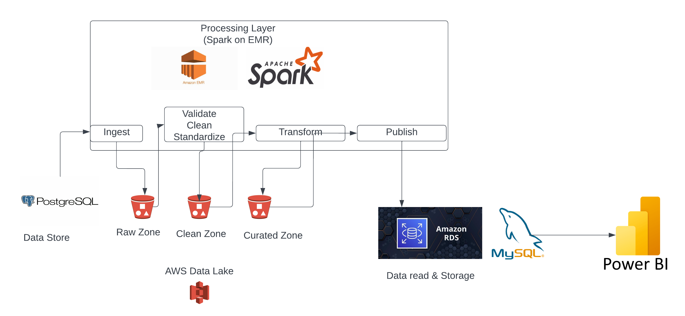
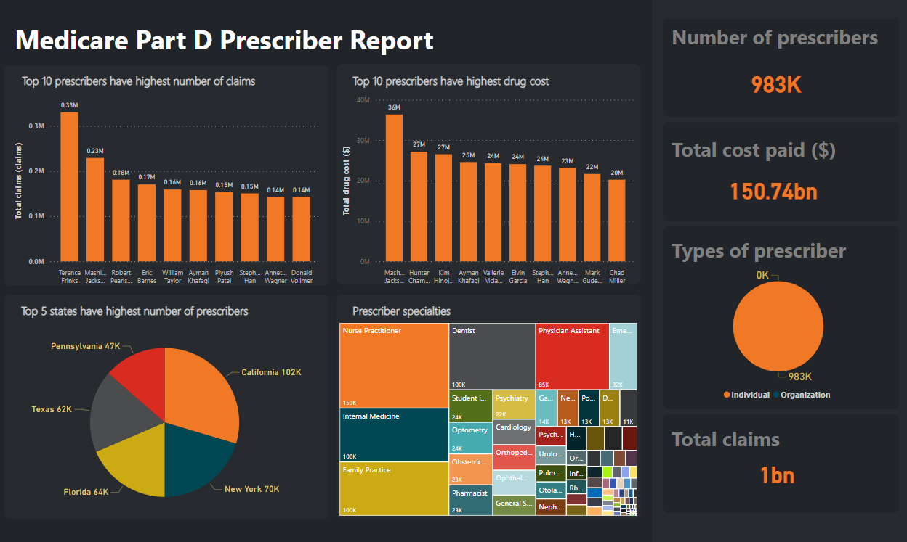

# Healthcare Data Pipeline

The project aims to build a single source of true data storage for large healthcare datasets using Spark and S3. Additionally, the project includes dashboards for visualization.

## Tech Stack

- **Data Lake:** Amazon S3
- **Data Source:** PostgreSQL
- **Data Read Storage:** MySQL on Amazon RDS
- **Processing Layer:** Apache Spark on EMR
- **Visualization:** Power BI

## Architecture

The architecture of this project is presented as follows:

- Data is sourced from PostgreSQL and ingested into the `raw zone` of the Data Lake hosted on S3.
- Raw data is cleansed and standardized before moving to the `cleansed zone`.
- Cleansed data is transformed into a reportable form and loaded into the `curated zone`.
- Data from the `curated zone` is published to Data Read Storage (MySQL on Amazon RDS) for higher performance reporting.
- Reports are created in Power BI from the data in MySQL.

## Data Source

- The source of raw data is from [CMS](https://data.cms.gov/provider-summary-by-type-of-service), specifically Medicare Part D data.
- The PostgreSQL database includes the following tables with a total size of around 10 GB:
  - Prescriber_drug: ~25M rows
  - Prescriber: ~1.1M rows
  - Drug: ~115K rows
  - State: ~30K rows

## Visualization

Some dashboards created from the data in the data read storage:

### Drug Report

- Displays the top 10 most used drugs, the top 10 drugs with the highest total cost, and the distribution of drug types.
- Shows metrics such as the number of drugs, total cost for drugs, and the number of drug brands.

### Prescriber Report

- Highlights the top 10 prescribers by the number of claims and total drug cost.
- Displays the top states with the highest number of prescribers and the specialties of prescribers.
- Includes metrics such as the number of prescribers, total cost paid, and the total number of claims.

## Achievements in Learning

### Apache Spark

- Understanding Spark components and their functionalities.
- Optimizing Spark performance and costs by adjusting resources (RAM, CPU, instances).
- Tuning Spark applications using partitions.
- Implementing a full data pipeline using Spark.
- Writing correct and efficient Spark code.
- Managing Jar files for JDBC connections.

### Project Setup

- Implementing comprehensive logging and log file management to track Spark applications.
- Testing the project in local mode before running it on the cluster.

### AWS

- Setting up and configuring EMR for running Spark applications.
- Monitoring and tracking resource utilization in EMR to ensure efficient operation.
